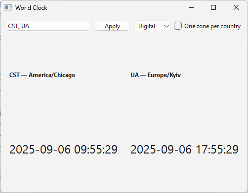
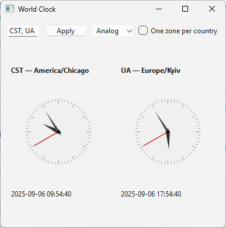

World Clock (CLI + PySide6 GUI)

Requirements
- Python 3.12+
- tzdata (on Windows, to provide IANA time zone database)
- PySide6 (for GUI)

Time zone input
- You can pass ISO country codes (US, IN, GB), IANA zone names (America/Chicago), or common abbreviations (e.g., CST, EST, IST). Abbreviations are mapped to representative defaults (e.g., CST -> America/Chicago).

Install
pip install tzdata PySide6

Run - CLI
python -m world_clock US IN GB
python -m world_clock CST Europe/London America/Chicago

Options:
- --one-per-country: show one representative zone per country
- --no-seconds: hide seconds
- --interval N: refresh every N seconds

Run - GUI
python -m world_clock --gui

Usage in GUI
- Enter country codes or time zones separated by commas, e.g., US,IN,GB or CST,America/Chicago
- Toggle Digital/Analog
- Optionally limit to one zone per country

Notes
- Daylight Saving Time and offsets are handled by zoneinfo automatically.
- The embedded zone mapping is based on IANA zone1970.tab (simplified).